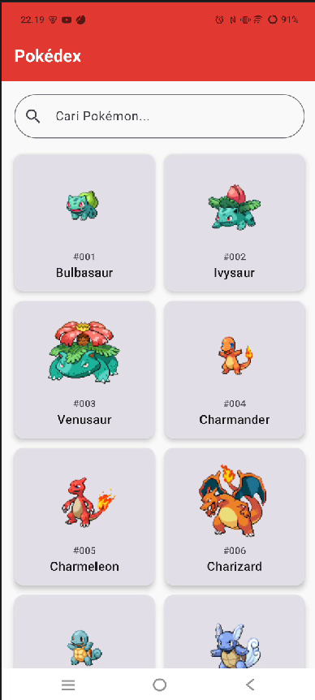
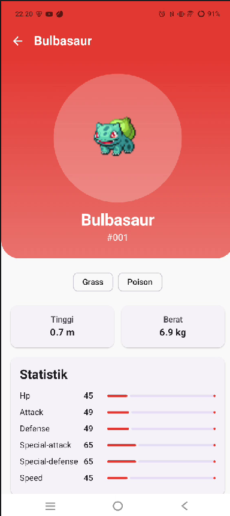

# Pokédex: Aplikasi Katalog dan Eksplorasi Pokémon

Aplikasi Android untuk mencari, melihat, dan mengeksplorasi informasi Pokémon dari [PokéAPI](https://pokeapi.co/). Dibangun dengan Kotlin, Jetpack Compose, Material Design 3, dan arsitektur MVVM.

## Identitas

| |                              |
|---|------------------------------|
| **Nama** | FARIZ RAHMAN SYAHIDA         |
| **NIM** | H1D024008                    |
| **Shift Asal** | Shift F                      |
| **Shift Sekarang** | Shift C                      |
| **Mata Kuliah** | Praktikum Pemrograman Mobile |


---

## Screenshot


|                      Tampilan Utama (Home)                       |                           Tampilan Detail                           |
|:----------------------------------------------------------------:|:-------------------------------------------------------------------:|
|                    |                     |
|               Daftar Pokémon, pencarian, dan grid                |               Informasi lengkap Pokémon yang dipilih                |

---

## Fitur

**Home Screen**
- Judul aplikasi pada top app bar
- Search bar untuk mencari Pokémon berdasarkan nama (tidak peka huruf besar/kecil)
- Daftar Pokémon dalam `LazyVerticalGrid` (gambar, nama, dan nomor ID)
- Loading state saat data sedang diambil
- Error state dengan tombol **Coba Lagi**
- Pesan khusus ketika hasil pencarian kosong

**Detail Screen**
- Gambar, nama, dan ID Pokémon
- Tipe Pokémon (chip, bisa lebih dari satu)
- Tinggi (meter) dan berat (kilogram)
- Statistik dasar dalam bentuk progress bar
- Loading dan error state tersendiri, serta tombol kembali

**Umum**
- Navigasi antar layar dengan Navigation Compose
- Gambar fallback lokal bila gambar dari API gagal dimuat
- Theme dan typography Material 3 kustom

---

## Teknologi

| Kebutuhan | Yang digunakan |
|---|---|
| Bahasa | Kotlin |
| UI | Jetpack Compose + Material Design 3 |
| Arsitektur | MVVM |
| Networking | Retrofit 2 + Gson Converter |
| Gambar | Coil (`AsyncImage`) |
| Navigasi | Navigation Compose |
| Asynchronous | Kotlin Coroutines + StateFlow |

---

## Arsitektur

Aplikasi memakai pola **MVVM** dengan alur satu arah: data mengalir dari API ke layar, dan aksi pengguna mengalir dari layar ke ViewModel.

```
PokéAPI
   ▲  │
   │  ▼
PokeApiService (Retrofit)      ← mendefinisikan endpoint
   ▲  │
   │  ▼
PokemonRepository              ← mengambil data, mengubah ke model UI, menangani error
   ▲  │
   │  ▼
ViewModel (Home / Detail)      ← menyimpan state (StateFlow)
   ▲  │
   │  ▼
Composable (Screen)            ← menampilkan UI sesuai state
```

### Peran tiap layer

| Layer | Komponen | Tugas |
|---|---|---|
| **View** | `HomeScreen`, `DetailScreen`, `PokemonCard`, `TypeChip`, `StatBar`, `LoadingView`, `ErrorView` | Menampilkan UI dan meneruskan aksi pengguna. Tidak memanggil API langsung |
| **ViewModel** | `HomeViewModel`, `DetailViewModel` | Memanggil repository, menyimpan state UI, menyaring hasil pencarian |
| **Repository** | `PokemonRepository` | Perantara ke API, membungkus hasil dengan `Result` agar error tidak membuat aplikasi crash |
| **API Service** | `PokeApiService`, `RetrofitClient` | Mendefinisikan endpoint dan membangun instance Retrofit |
| **Data Model** | `PokemonListResponse`, `PokemonDetailResponse`, `Pokemon` | Cetakan data dari JSON dan model untuk UI |

### Struktur folder

```
com.pemmob.responsi1_fariz
├── data
│   ├── model        PokemonListResponse, PokemonDetailResponse, Pokemon
│   ├── api          PokeApiService, RetrofitClient
│   └── repository   PokemonRepository
├── ui
│   ├── theme        Color, Theme, Type
│   ├── components   PokemonCard, PokemonImage, TypeChip, StatBar, LoadingView, ErrorView
│   ├── home         HomeUiState, HomeViewModel, HomeScreen
│   └── detail       DetailUiState, DetailViewModel, DetailScreen
├── navigation       AppNavGraph
└── MainActivity.kt
```

---

## API yang Digunakan

Aplikasi memakai **PokéAPI** (`https://pokeapi.co/api/v2/`). API ini gratis dan tidak membutuhkan API key. Dokumentasi: https://pokeapi.co/docs/v2

### Endpoint

| Kegunaan | Endpoint | Dipakai di |
|---|---|---|
| Daftar Pokémon | `GET /pokemon?limit=1025&offset=0` | Home Screen |
| Detail Pokémon | `GET /pokemon/{name}` | Detail Screen |

### Data yang diambil

**Dari endpoint daftar** (`results[i]`):

| Field JSON | Dipakai untuk |
|---|---|
| `name` | Nama Pokémon |
| `url` | Diambil angka ID-nya (`.../pokemon/25/` menjadi `25`) |

**Dari endpoint detail:**

| Field JSON | Dipakai untuk |
|---|---|
| `id` | Nomor Pokémon |
| `name` | Nama Pokémon |
| `height` | Tinggi (desimeter, dibagi 10 menjadi meter) |
| `weight` | Berat (hektogram, dibagi 10 menjadi kilogram) |
| `types[i].type.name` | Tipe Pokémon |
| `stats[i].base_stat` dan `stats[i].stat.name` | Statistik dasar |

Field lain di JSON (misalnya `moves` dan `abilities`) tidak dipakai dan diabaikan oleh Gson.

### Gambar

Endpoint daftar tidak menyertakan gambar. Gambar diambil dari repositori sprite milik PokéAPI berdasarkan ID, dengan pola:

```
https://raw.githubusercontent.com/PokeAPI/sprites/master/sprites/pokemon/{id}.png
```

Dengan cara ini, seluruh daftar cukup dimuat dengan satu request, tanpa memanggil endpoint detail satu per satu.

---

## Penjelasan Teknis Implementasi

### Fitur Kotlin yang dimanfaatkan

| Fitur | Penerapan |
|---|---|
| **Data class** | `Pokemon`, `PokemonListResponse`, `PokemonResult`, `PokemonDetailResponse`, `TypeSlot`, `StatSlot`, `NamedResource`, serta `Success` dan `Error` pada UI state |
| **Null safety** | `next: String?` pada respons list, `toIntOrNull() ?: 0` saat mengambil ID, dan `it.message ?: "Terjadi kesalahan"` pada error state |
| **Lambda** | `results.map { it.toPokemon() }`, `filter { ... }`, `onClick`, dan `onRetry` sebagai parameter composable |
| **Extension function** | `String.capitalizeFirst()` dan `Int.toPokedexNumber()` |
| **Sealed interface** | `HomeUiState` dan `DetailUiState` (Loading, Success, Error) |

### State dan recomposition

- Status layar disimpan di ViewModel sebagai `MutableStateFlow<UiState>`, dan hanya versi baca-saja (`StateFlow`) yang diekspos ke layar.
- Layar membaca state dengan `collectAsStateWithLifecycle()`. Ketika state berubah, Compose menjalankan **recomposition** hanya pada bagian UI yang membaca state tersebut.
- Blok `when` memilih tampilan sesuai state: `Loading` menampilkan indikator, `Error` menampilkan pesan dan tombol coba lagi, `Success` menampilkan grid.
- Kata pencarian disimpan di `StateFlow` terpisah. Daftar yang tampil dihitung dengan `combine(uiState, searchQuery)` sehingga otomatis diperbarui setiap kali data atau kata pencarian berubah, tanpa request ulang ke API.

### Penanganan error

`PokemonRepository` membungkus setiap pemanggilan API dengan `runCatching` dan mengembalikan `Result`. Kegagalan seperti tidak ada internet atau server error diubah menjadi nilai biasa, lalu ViewModel mengubahnya menjadi `Error` state sehingga aplikasi tidak crash.

### Navigasi

`AppNavGraph` memiliki dua rute: `home` dan `detail/{name}`. Saat kartu ditekan, nama Pokémon dikirim sebagai argumen rute, lalu `DetailScreen` memuat detailnya dari API.

### Reusable composable

`PokemonCard`, `PokemonImage`, `TypeChip`, `StatBar`, `LoadingView`, dan `ErrorView` dibuat sebagai komponen mandiri yang menerima data lewat parameter, sehingga dapat dipakai di beberapa layar.

---

## Cara Menjalankan

1. Clone repository:
   ```bash
   git clone git@github.com:HAWKCAN/Responsi1PrakriumMobile_H1D024008.git
   ```
2. Buka folder project di Android Studio dan tunggu Gradle sync selesai.
3. Pastikan perangkat atau emulator memiliki koneksi internet.
4. Jalankan aplikasi dengan menekan **Run**.

---

## Video Penjelasan Kode

Link video: https://youtu.be/GU0idcCGRsE